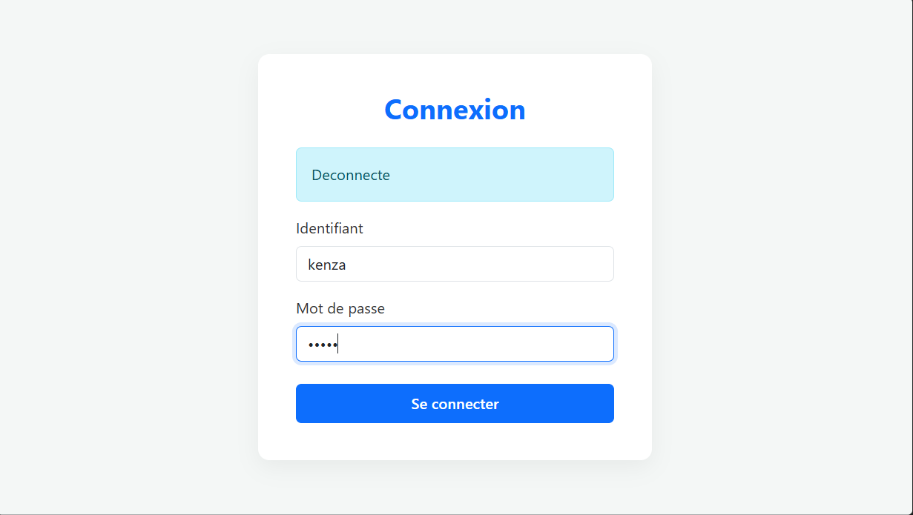
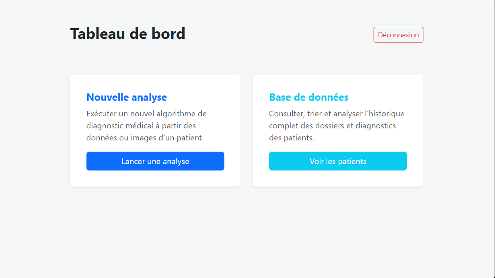
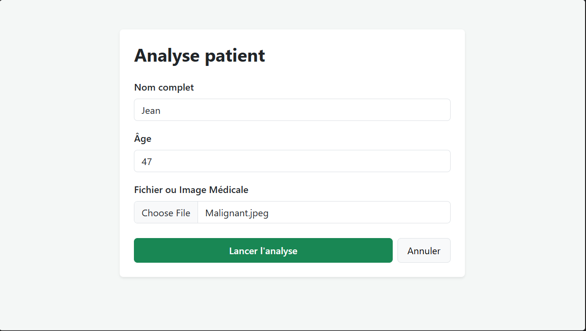
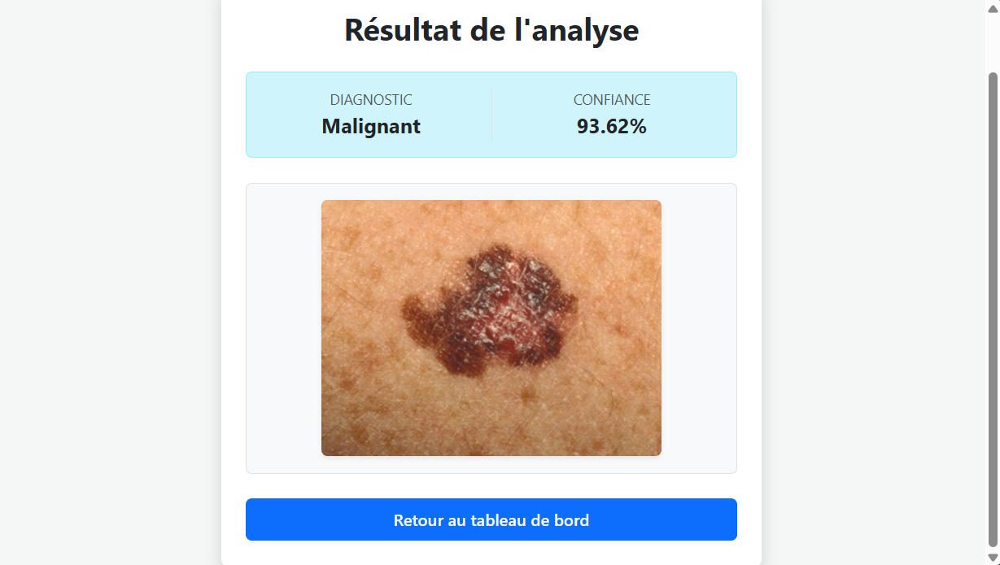

# Skin Cancer Detection Web App (Flask + Deep Learning)

## 📌 Overview

This project is a web-based **Skin Cancer Detection System** built using **Flask** and a **deep learning model (VGG16)**.
It allows users to upload skin lesion images and receive a prediction (Benign or Malignant), along with probability scoring.

The system also stores patient data and prediction history in a **MySQL database** for later review.

---

## 🧠 Features

* User login system
* Image upload for skin lesion analysis
* Deep learning-based prediction (VGG16 model)
* Result display (Benign / Malignant)
* Probability score output
* Patient history storage
* Dashboard interface
* MySQL database integration

---

## 🖥️ Project Interface Screenshots

### 🔐 Login Page

### 📊 Dashboard Page

### 🧪 Prediction Result Page

### 🧪 Result Page

---

## 📁 Project Structure

```
SKIN_CANCER_APP/
│
├── app.py
├── model/
│   └── vgg16_skin_cancer.h5   # (not included in repo)
│
├── templates/
│   ├── login.html
│   ├── dashboard.html
│   ├── predict.html
│   ├── result.html
│   └── patients.html
│
├── static/
│   ├── style.css
│   └── uploads/   # stores uploaded mock patient images temporarily for prediction & display
│
├── skin_cancer_db.sql   # ready-to-use SQL file for MySQL setup
│
└── requirements.txt
```

---

## 🗄️ Database Setup (MySQL)

This project uses **MySQL (XAMPP)** with two tables:

* `users` → for authentication
* `patients` → for storing predictions

A ready-to-use SQL file is already included in the repository:

```
skin_cancer_db.sql
```

You can directly import it into MySQL (via phpMyAdmin or MySQL Workbench) instead of manually running queries.

---

## 🧠 Model File

The trained deep learning model is not included in this repository due to its size.

### 📥 Download Model:

https://drive.google.com/file/d/1MFs1MlvkvNrjQw_4ysqZB3tI-AMyPbw2/view?usp=sharing

After downloading, place it here:

```
model/vgg16_malignant_benign.h5
```

---

## 📓 Notebook (Training Code)

The model was trained using a Jupyter Notebook.

### 📥 Download Notebook:

https://colab.research.google.com/drive/1iwNHiRUTciuZmTGZPbU9bN3SD-KPhc1E?usp=sharing

---

## ⚙️ Installation & Setup

### 1. Clone repository

```bash
git clone https://github.com/your-username/skin-cancer-app.git
cd skin-cancer-app
```

### 2. Create virtual environment

```bash
python -m venv venv
venv\Scripts\activate   # Windows
```

### 3. Install dependencies

```bash
pip install flask numpy tensorflow mysql-connector-python pillow
```

### 4. Run application

```bash
python app.py
```

---

## 🚀 Tech Stack

* Python
* Flask
* TensorFlow / Keras (VGG16)
* MySQL
* HTML / CSS / Bootstrap
* NumPy

---

## 📌 Notes

* Make sure MySQL server (XAMPP) is running before launching the app.
* Ensure the database `skin_cancer_db` is created before running.
* Model file must be placed inside `/model` folder.
* Uploaded images are stored temporarily in `static/uploads/` for prediction and display purposes.

---

## 👨‍💻 Author

Developed as a personal/academic project for deep learning + web integration practice.
